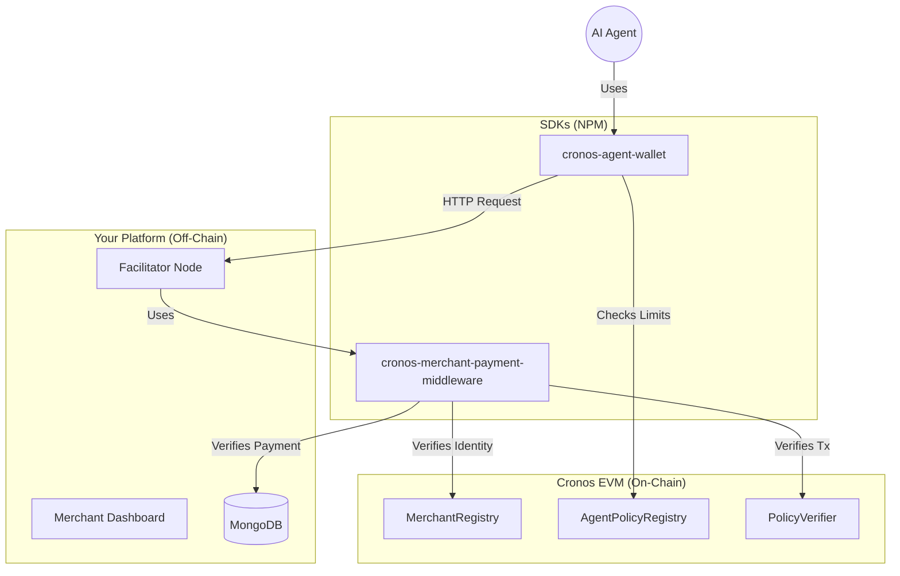

# 🤖 Cronos Merchant Gateway (x402)

**The Payment Layer for the Machine-to-Machine (M2M) Economy.**

This repository contains a complete ecosystem for enabling **Autonomous AI Agents** to pay for API access using **USDC on Cronos**. It implements the **HTTP 402 Payment Required** protocol to create a seamless, zero-interaction payment flow between robots and services.

---

## � Hackathon Alignment

This project is built directly for the **Cronos "Agentic Intelligence" Hackathon**, targeting:

-   **Main Track – x402 Applications**: We enable autonomous agents to pay for APIs via HTTP 402 and on-chain settlement.
-   **Agentic Finance Track**: Our `Cronos-Agent-Wallet` is a policy-aware smart wallet with self-custodial spending guardrails.
-   **Dev Tooling Track**: We provide plug-and-play middleware + SDKs for instant API monetization.

---

## 🏗️ Architecture

The ecosystem combines off-chain speed with on-chain security:



### 📂 Repository Structure

| Folder | Package Name | Description |
| :--- | :--- | :--- |
| **`client`** | `client` | **Merchant Dashboard** (Next.js). UI for merchants to view sales, analytics, and register. |
| **`server`** | `server` | **The "Facilitator"**. An Express backend that verifies on-chain transactions and serves the API. |
| **`share`** | `cronos-agent-wallet` | **Agent SDK**. A crypto wallet for AI agents that handles "402 Payment Required" challenges automatically. |
| **`payment-middleware`** | `cronos-merchant-payment-middleware` | **Middleware**. A plug-and-play Express tool to monetize any API route instantly. |

---

## 🔄 End-to-End Flow

1.  **Merchant registers** identity on Cronos (via Dashboard).
2.  **Merchant wraps** their API with our payment middleware.
3.  **Agent calls API** and receives `HTTP 402 Payment Required`.
4.  **Agent SDK verifies** its own on-chain policy (budget) & the price.
5.  **Agent executes** an on-chain USDC payment.
6.  **API request retries** automatically with payment proof and succeeds.

---

## ⚖️ Why On-Chain + Off-Chain?

We use a hybrid architecture to balance **security** with **performance**:

*   **On-Chain (Cronos EVM):** Handles critical trust layers—Merchant Identity, Agent Policy (Spend Limits), and final Value Settlement. This ensures no one can spoof an identity or overspend a budget.
*   **Off-Chain (Middleware/DB):** Handles high-frequency API gating, nonce generation, and state tracking. This ensures APIs remain fast (<100ms) without waiting for block confirmations for every single packet, while still cryptographically verifying every payment.

---

## 🔗 On-Chain Components

*   **`MerchantRegistry`**: The on-chain source of truth for merchant identities and receiving addresses.
*   **`AgentPolicyRegistry`**: Stores hash commitments of agent spending policies (Daily Limit / Max Per Tx), ensuring agents cannot be hijacked to drain wallets.
*   **`PolicyVerifier`**: A stateless contract used to valid policy compliance on-chain.

---

## ✨ Key Features

*   **🤖 Autonomous Payments**: AI Agents can negotiate and pay for resources without human intervention.
*   **🛡️ Zero-Trust Security**: The server never trusts the client. All payments are verified directly on the Cronos blockchain.
*   **🔒 Replay Protection**: Every transaction is bound to a specific request nonce, preventing replay attacks.
*   **📊 Basic Analytics**: Visualize your revenue, track payment conversion rates, and monitor agent activity.
*   **🌍 Multi-Chain Ready**: Architecture supports expansion to other EVM chains (currently optimized for Cronos).

---

## 🚀 Getting Started

### 1. Prerequisites
*   Node.js v18+
*   MongoDB Atlas Account
*   Cronos Testnet Wallet (w/ TCRO and USDC)

### 2. Installation
Install dependencies for all packages:
```bash
# Install root dependencies (if any)
npm install

# Install submodule dependencies
cd client && npm install
cd ../server && npm install
cd ../share && npm install
cd ../payment-middleware && npm install
```

### 3. Running Locally

**Start the Backend (Facilitator):**
```bash
cd server
cp .env.example .env # Configure your MONGO_URI and PRIVATE_KEY
npm run dev
# Running on http://localhost:5000
```

**Start the Frontend (Dashboard):**
```bash
cd client
cp .env.example .env.local
npm run dev
# Running on http://localhost:3000
```

---

## 📦 NPM Packages

This repository publishes two core packages to NPM:

1.  **[cronos-agent-wallet](https://www.npmjs.com/package/cronos-agent-wallet)**: For AI Developers building agents.
2.  **[cronos-merchant-payment-middleware](https://www.npmjs.com/package/cronos-merchant-payment-middleware)**: For API Developers monetizing their data.

---

## 📜 License

MIT © 2026. Built for the Cronos Ecosystem.
