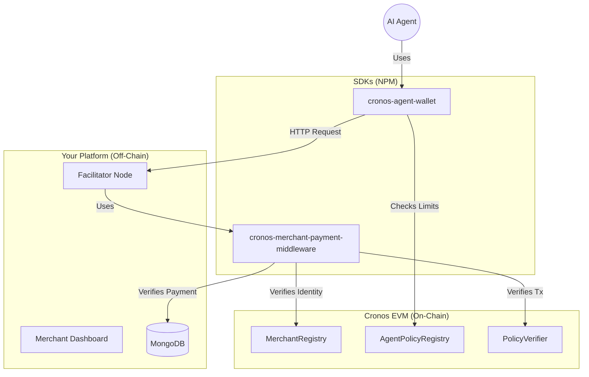

#  <br/> Cronos Merchant Gateway (x402)

**The Payment Layer for the Machine-to-Machine (M2M) Economy.**

> **🛑 The Problem:** Autonomous AI Agents cannot easily pay for resources. They struggle with credit card KYCs, cannot click "Buy Now" buttons, and relying on human owners to top up balances manually is slow and unscalable.
>
> **✅ The Solution:** A specialized payment gateway implementing the **HTTP 402 Payment Required** standard. It allows agents to stream USDC payments instantly on the Cronos EVM chain, verified by a policy engine that prevents wallet draining.

---

## 🏆 Hackathon Alignment

This project is built directly for the **Cronos "Agentic Intelligence" Hackathon**:

-   **Main Track – x402 Applications**: We enable autonomous agents to pay for APIs via HTTP 402 and on-chain settlement.
-   **Agentic Finance Track**: Our `Cronos-Agent-Wallet` is a policy-aware smart wallet with self-custodial spending guardrails.
-   **Dev Tooling Track**: We provide plug-and-play middleware + SDKs to monetize any API in minutes.

---

## 🔗 Live Contracts (Cronos Testnet)

All core infrastructure is deployed and live on the Cronos Testnet (Chain ID: 338).

| Contract | Address | Description |
| :--- | :--- | :--- |
| **MerchantRegistry** | [`0x1948175dDB81DA08a4cf17BE4E0C95B97dD11F5c`](https://explorer.cronos.org/testnet/address/0x1948175dDB81DA08a4cf17BE4E0C95B97dD11F5c) | Maps generic `merchantId` strings to EVM payment addresses. |
| **AgentPolicyRegistry** | [`0xce3b58c9ae8CA4724d6FA8684d2Cb89546FF4E43`](https://explorer.cronos.org/testnet/address/0xce3b58c9ae8CA4724d6FA8684d2Cb89546FF4E43) | Stores unbreakable spending limits (Daily Limit, Max Per Tx) for every agent. |
| **PolicyVerifier** | [`0xFCb2D2279256B62A1E4E07BCDed26B6546bBc33b`](https://explorer.cronos.org/testnet/address/0xFCb2D2279256B62A1E4E07BCDed26B6546bBc33b) | Stateless logic contract to validate payments against policies. |
| **USDC (Testnet)** | `0x6a...` (Standard) | The currency of settlement. |

---

## 🏗️ Architecture

The ecosystem combines off-chain speed with on-chain security:



---

## 📡 API Endpoints (Merchant Facilitator)

The Facilitator Server (`/server`) acts as the gateway. Key endpoints include:

### 💰 Monetized Routes (Middleware Demo)
| Method | Endpoint | Description |
| :--- | :--- | :--- |
| `POST` | `/api/premium` | **The Core 402 Demo.** protected by middleware. Returns `402 Payment Required` until a valid payment is attached. |

### 🛠️ Core Infrastructure
| Method | Endpoint | Description |
| :--- | :--- | :--- |
| `POST` | `/api/merchants/register` | Registers a new merchant identity on Cronos. |
| `POST` | `/api/price-check` | Dynamic pricing engine. Determines cost based on agent reputation/load. |
| `POST` | `/api/facilitator/verify` | **The Callback.** Verifies an on-chain Transaction Hash provided by an agent. |
| `GET` | `/api/analytics/history` | Fetches payment history for the dashboard charts. |

---

## 🔄 End-to-End Flow

1.  **Merchant registers** identity on Cronos (via Dashboard).
2.  **Merchant wraps** their API with our payment middleware.
3.  **Agent calls API** (`/api/premium`) and receives `HTTP 402 Payment Required` + `X-Payment-Address` + `Price`.
4.  **Agent SDK verifies** its own on-chain policy (budget) & the invoice integrity.
5.  **Agent executes** an on-chain USDC payment to the Merchant's address.
6.  **Agent retries** the request, attaching the `X-Payment-Tx-Hash`.
7.  **Middleware verifies** the transaction on-chain via the Facilitator and serves the resource.

---

## 🚀 Getting Started

### 1. Prerequisites
*   Node.js v18+
*   MongoDB Atlas Account
*   Cronos Testnet Wallet (w/ TCRO and USDC)

### 2. Installation
Install dependencies for all packages:
```bash
# Install root dependencies
npm install

# Install submodule dependencies
cd client && npm install
cd ../server && npm install
cd ../share && npm install
```

### 3. Running Locally

**Start the Backend (Facilitator):**
```bash
cd server
cp .env.example .env # Configure MONGO_URI and PRIVATE_KEY
npm run dev
# Running on http://localhost:5000
```

**Start the Frontend (Dashboard):**
```bash
cd client
cp .env.example .env.local
npm run dev
# Running on http://localhost:3000
```

---

## 📦 NPM Packages

This repository publishes two core packages to NPM:

1.  **[cronos-agent-wallet](https://www.npmjs.com/package/cronos-agent-wallet)**: For AI Developers building agents.
2.  **[cronos-merchant-payment-middleware](https://www.npmjs.com/package/cronos-merchant-payment-middleware)**: For API Developers monetizing their data.

---

## 📜 License
MIT © 2026. Built for the Cronos Ecosystem.
